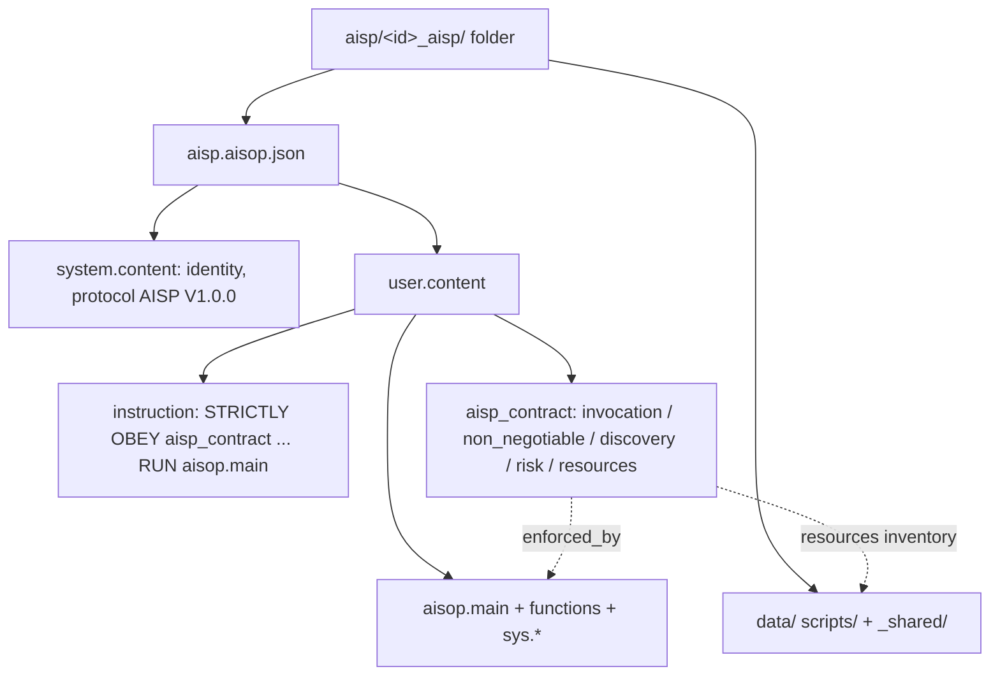

# Core Concepts

This document provides a detailed walkthrough of the foundational concepts that underpin the AI Skill Protocol (AISP). It covers naming conventions, the skill folder, the two tiers, the skill contract, the file anatomy, and discovery. Readers should be familiar with the high-level overview in [What is AISP?](what-is-aisp.md) before proceeding.

---

## Naming Conventions

AISP reuses AISOP's language format and adds its own packaging identifiers. Each name carries one and only one meaning.

| Name | Analogy | What it is |
|------|---------|------------|
| `.aisop.json` | A source file extension | The AISOP language format — the skill body is fundamentally a `.aisop.json` program |
| `aisp.aisop.json` | `SKILL.md` / `package.json` | The fixed, well-known file name for a skill body |
| `_aisp` | `.app`, `.crate` | The skill-folder type suffix — the folder name == `id` and ends with `_aisp` (mirroring the convention the sibling AIAP protocol uses for `_aiap`) |
| `aisp_contract` | `package.json` manifest fields | The skill contract — a real object in the user message |

---

## The Skill Folder

A skill is **one self-contained folder**. It can be browsed by a human, an AI, or `bash`; it can be zipped, hashed, and published as a single registry unit.

```text
aisp/
  README.md                    # MUST: how to discover / run / add a skill
  aisp_list.py                 # discovery script (zero-dependency)
  aisp_list.json               # index cache
  yijing_aisp/                 # folder name = id "yijing_aisp" (MUST end with _aisp)
    aisp.aisop.json            # the skill body (an AISOP program)
    README.md                  # SHOULD: generated bootstrap projection from aisp.aisop.json
    data/
      hexagrams.json
      interpretation_guide.md
  _shared/                     # cross-skill shared resources (no _aisp suffix)
    finance_terms.md
```

Rules:

1. One skill = one `aisp/<id>/` folder; the folder name **MUST** equal `id` and end with `_aisp`.
2. The body file name is fixed at `aisp.aisop.json`.
3. Per-skill `README.md` is generated from the contract; it improves portability but is not the source of truth.
4. Resource layout is **custom** (`data/` / `scripts/` / …), declared in the contract — no fixed subfolders are forced.
4. `_shared/` holds shared resources (`scope: "shared"`); it has no `_aisp` suffix, so the discovery glob `aisp/*_aisp/aisp.aisop.json` skips it automatically.

---

## The Two Tiers

`aisp.aisop.json` contains two tiers. The contract is lean; the execution is heavy.

| Tier | Holds | Where |
|------|-------|-------|
| **Tier A — execution (heavy)** | flow / steps / role / principles / knowledge / constraints / failure / confirmation / validation / structured output / resource **usage** / tools / state | `aisop.main` + `functions` + `sys.*` + `tools` / `params` |
| **Tier S — contract (lean)** | triggering / red-line binding / discovery / risk / resource **inventory** | `user.content.aisp_contract` |

> The contract holds only what the execution tier cannot express, or what a consumer must know in advance. It **MUST NOT** duplicate Tier A content (role, principles, failure handling, output format).

---

## The Skill Contract

The contract is `user.content.aisp_contract` — a **real JSON object**, not a string. Example (from `yijing_aisp`):

```json
{
  "profile": "aisp.skill.v1",
  "invocation": {
    "mode": "auto_or_manual",
    "when_to_use": ["cast an I Ching reading", "interpret a hexagram"],
    "when_not_to_use": ["medical, legal, or financial decisions needing a professional", "no question provided"]
  },
  "non_negotiable": [
    { "rule": "Never interpret before casting.", "enforced_by": "aisop.main" },
    { "rule": "Do not interpret without a cast hexagram.", "enforced_by": "interpret.step1:sys.assert" },
    { "rule": "The reading must state it is for reflection, not deterministic prediction.", "enforced_by": "interpret.step4:sys.assert" }
  ],
  "discovery": { "category": "culture", "tags": ["yijing", "iching", "divination", "hexagram"] },
  "risk_level": "low",
  "resources": [
    { "id": "hexagrams", "path": "data/hexagrams.json", "kind": "data", "mode": "read_only" },
    { "id": "interpretation_guide", "path": "data/interpretation_guide.md", "kind": "reference", "mode": "read_only", "when": "interpreting the hexagram" }
  ]
}
```

See [The Skill Contract](skill-contract.md) for the full field reference.

---

## File Anatomy

A skill body is a **2-message array**: a `system` message (program identity) and a `user` message (the live content this turn, including the contract).

```json
[
  { "role": "system", "content": { "...program identity..." } },
  { "role": "user",   "content": { "instruction": "...", "user_input": "{user_input}", "aisp_contract": { }, "aisop": { }, "functions": { } } }
]
```

### role

Two messages: `system` and `user`. Program identity (`protocol`, `axiom_0`, `id`, `name`, `version`, `license`, `summary`, `description`, `flow_format`, `loading_mode`, `tools`, `params`, `system_prompt`) lives on `system.content`. The skill's `protocol` is the literal `"AISP V1.0.0"`; `loading_mode` is fixed to `"node"` for AISP skills; `license` defaults to `"Apache-2.0"`.

### user.content.instruction

A strong directive that commands obedience to the contract before running the graph:

```text
"STRICTLY OBEY aisp_contract; its non_negotiable rules are inviolable; then RUN aisop.main"
```

This is what makes the model *read* the contract this turn rather than gamble on runtime rendering.

### user.content.aisp_contract

The skill contract — a real object, alongside `instruction` / `user_input` / `aisop` / `functions`. The model reads it directly. This is allowed because AISOP applies open-world validation and tolerates the extra key.

### aisop.main

The execution graph (Mermaid or JSON flow). All execution starts at `aisop.main`.

```text
graph TD
    clarify[Clarify the question] --> cast[Cast hexagram]
    cast --> interpret[Interpret]
    interpret --> end_node((End))
```

### functions

Per-node logic — natural-language numeric execution steps (`step1`, `step2`, ...) plus optional `constraints`, `output_mapping`, and `sys.*` calls. This is where role, principles, knowledge, failure handling, and resource **usage** live (Tier A). Metadata fields such as `step_note` do not count as execution steps.

```json
"interpret": {
  "step1": "sys.assert('hexagram != null', 'No hexagram has been cast')",
  "step2": "sys.io.read('data/interpretation_guide.md') -> guide",
  "step3": "sys.llm.json('Interpret the hexagram for the question using guide', schema={summary:'string', guidance:'string', disclaimer:'string'}) -> reading",
  "step4": "sys.assert('reading.disclaimer != null', 'Reading must state it is for reflection, not deterministic prediction')",
  "step5": "Render reading as Markdown.",
  "constraints": ["Ground the interpretation in the cast hexagram and guide; do not fabricate hexagrams."]
}
```

> `system_prompt` MAY be empty. The contract is carried in the user message, the task instructions are in `functions`, and hard guarantees are in `sys.*` — so `system_prompt` does not need to carry any of them.

---

## Discovery

Discovery is runtime-independent. Any agent with `bash` + `python` can run the script; any agent that reads JSON can read the index.

```text
L1  metadata    →  aisp_list.json (or script output): summary / invocation / discovery
L2  instructions →  on a hit, load the full aisp/<id>/aisp.aisop.json
L3  resources   →  nodes load via sys.io.read / sys.run on demand
```

The skill **folder** is the single source of truth; `aisp_list.py` is the generator; `aisp_list.json` is the cache. See [Discovery & Registry](discovery-and-registry.md).

---

## Putting It All Together



A skill is a folder; its body is an AISOP program; its contract is a lean object in the user message; its red lines bind to real `sys.*` mechanisms; and its resources are declared once and used on demand. That is the whole of AISP.

---

Align Axiom 0: Human Sovereignty and Wellbeing. AISP — AI Skill Protocol V1.0.0. www.aisp.dev
