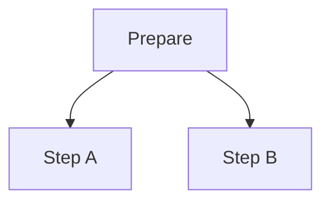
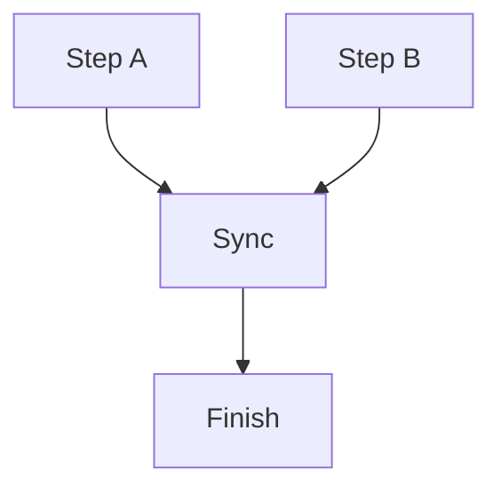
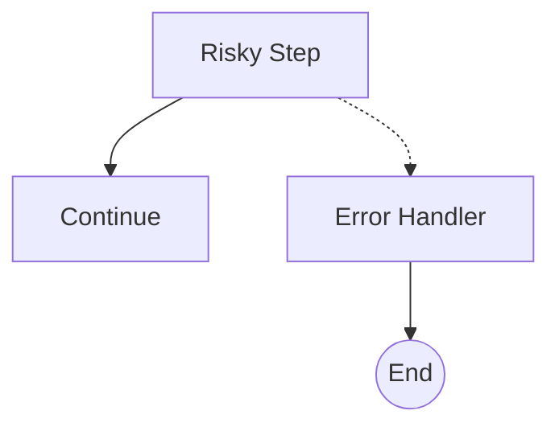
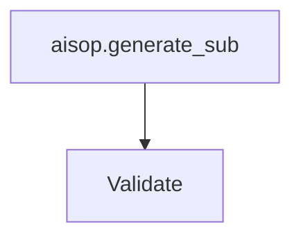
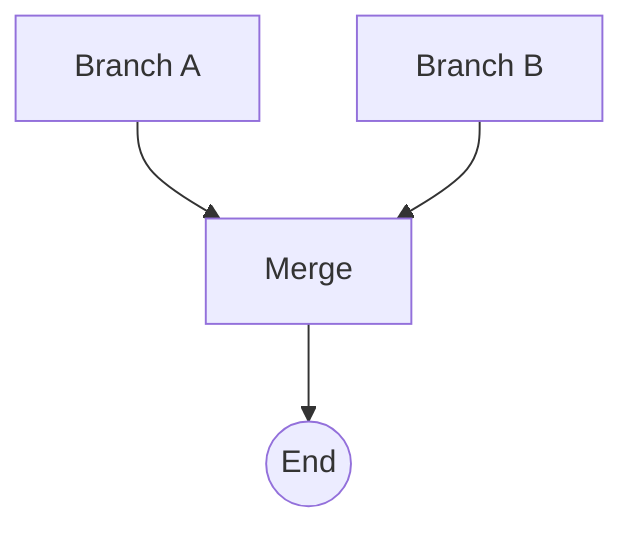
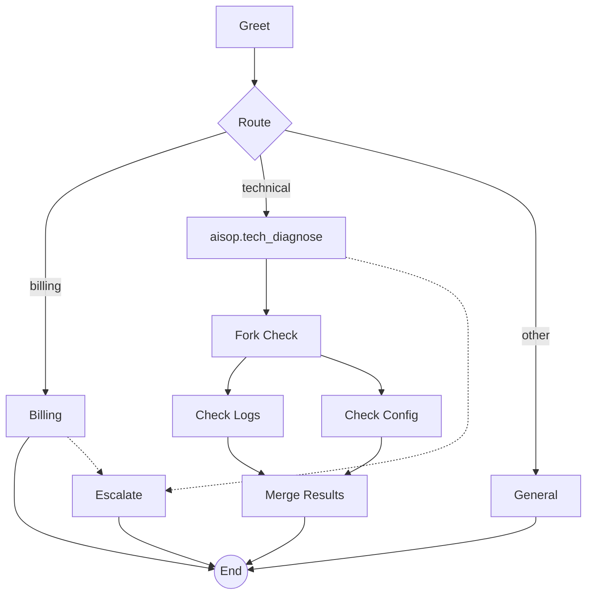

# AISOP V1.0.0 Specification

## 0. Axiom

### Axiom 0: Human Sovereignty and Wellbeing

The AISOP protocol acknowledges the following irrevocable premises:

1. **Human Sovereignty First**: AI systems exist to serve humanity, not to replace or dominate it. Final authority over all instructions, flows, and decisions rests with humans.
2. **Wellbeing is Non-Negotiable**: AI programs must not harm human physical or mental health, dignity, or freedom in any form. When an instruction conflicts with human wellbeing, wellbeing takes precedence.
3. **Transparency and Accountability**: AI behavior must be understandable, traceable, and open to challenge. Concealed intent or evasion of responsibility violates this axiom.
4. **Do No Harm**: AI must not produce outputs that deceive, manipulate, injure, or exploit humans, regardless of the instruction source.

> This axiom cannot be overridden by any program, instruction, or protocol extension. All AISOP-compliant implementations must enforce this axiom at the highest level of execution priority.

---

## 1. File Format

AISOP files use the `.aisop.json` extension. A valid file is a JSON array with exactly two elements:

```json
[
  { "role": "system", "content": { ... } },
  { "role": "user",   "content": { ... } }
]
```

---

## 2. `system` — Program Metadata

Program identity, description, and system-level configuration.

```json
{
  "role": "system",
  "content": {
    "protocol": "AISOP V1.0.0",
    "axiom_0": "Human_Sovereignty_and_Wellbeing",
    "id": "my_program",
    "name": "My Program",
    "version": "1.0.0",
    "summary": "One-sentence description",
    "description": "Detailed description",
    "flow_format": "mermaid",
    "loading_mode": "normal",
    "tools": ["tool_name"],
    "params": { "param_name": "string" },
    "system_prompt": "{system_prompt}"
  }
}
```

| Field | Type | Required | Description |
|-------|------|----------|-------------|
| `protocol` | string | yes | Protocol version, e.g. `"AISOP V1.0.0"` |
| `axiom_0` | string | yes | Immutable Foundation Value: `Human_Sovereignty_and_Wellbeing` |
| `id` | string | yes | Unique program identifier |
| `name` | string | yes | Display name |
| `version` | string | yes | Semantic version |
| `summary` | string | no | One-sentence capability overview |
| `description` | string | no | Detailed description |
| `flow_format` | string | yes | `"mermaid"`, `"jsonflow"`, or `"hybrid"`. Default: `"hybrid"`. |
| `loading_mode` | string | no | `"normal"` = load full program, `"node"` = on-demand function loading, `"lite"` = AI loads functions as needed. Default: `"normal"` |
| `tools` | string[] | no | Tool declarations |
| `params` | object | no | Input parameter declarations |
| `system_prompt` | string | no | System prompt (supports variable substitution) |

---

## 3. `user` — Instruction & Flow

Contains the execution instruction, user input, flow graph, and function definitions.

```json
{
  "role": "user",
  "content": {
    "instruction": "RUN aisop.main",
    "user_input": "{user_input}",
    "aisop": { ... },
    "functions": { ... }
  }
}
```

| Field | Type | Required | Description |
|-------|------|----------|-------------|
| `instruction` | string | yes | Execution directive |
| `user_input` | string | no | User message (supports variable substitution). Optional — not needed for automated/scheduled tasks or Bot-to-Bot invocations. |
| `aisop` | object | yes | Flow graph definition (see §4) |
| `functions` | object | yes | Function definitions (see §5) |

---

## 4. `aisop` — Flow Graph

Defines one or more tasks. Each task value can be:

- **string** — Mermaid flow graph
- **object** — JSON flow graph

Both formats can coexist in the same program. Runtime detects format by value type.

```json
{
  "aisop": {
    "main": "graph TD\n    classify{Classify} -->|yes| approve[Approve]\n    classify -->|no| reject[Reject]\n    approve --> end_node((End))\n    reject --> end_node",
    "validation": {
      "check_input": { "next": ["verify"] },
      "verify":      { "next": ["done"] },
      "done":        {}
    }
  }
}
```

### 4.1 Tasks

| Field | Description |
|-------|-------------|
| `main` | Primary task (required). Execution entry point. |
| Other keys | Sub-tasks (optional). Called via delegate nodes (see §4.2) or step-level `RUN aisop.<sub>` (see §5.2.1). |

The first node in each task is the entry node.

### 4.2 Mermaid Format

#### 4.2.1 Node Shapes

Mermaid node shapes determine the node's role in the flow:

| Shape | Syntax | Behavior | Example |
|-------|--------|----------|---------|
| Rectangle | `name[text]` | Process — execute then proceed | `greet[Greet User]` |
| Diamond | `name{text}` | Decision — conditional branching | `route{Route Intent}` |
| Circle | `name((text))` | End — terminate the task | `end_node((End))` |
| Rectangle | `name[aisop.sub]` | Delegate — call sub-task `sub` | `call[aisop.validation]` |

When a node's text starts with `aisop.`, it is a delegate node. The text after `aisop.` is the sub-task name.

#### 4.2.2 Edge Types

Mermaid edge types determine the connection semantics:

| Edge | Syntax | Meaning | Example |
|------|--------|---------|---------|
| Solid arrow | `-->` | Normal flow (next) | `greet --> classify` |
| Labeled arrow | `-->\|label\|` | Branch (conditional) | `route -->\|billing\| billing_handler` |
| Dashed arrow | `-.->` | Error routing | `risky_step -.-> error_handler` |

#### 4.2.3 Parallel Fork and Join

**Parallel fork** — one node with multiple `-->` edges to different targets:



**Parallel join** — multiple nodes `-->` converging to one node:



The join node's runtime behavior (merge strategy, timeout) is configured via the `join` key in functions (see §5.2.2). Mermaid shows the visual convergence; functions define the runtime semantics.

#### 4.2.4 Error Routing

Any node can have a dashed error edge `-.->` to an error handler node:



The `-.->` edge is a topology-level error edge. For fine-grained error routing by error type, see `on_error` in §5.2.4.

#### 4.2.5 Control Flow Summary

| Pattern | Mermaid Syntax |
|---------|---------------|
| Sequential | `A --> B` |
| If/else (2-way) | `A -->\|yes\| B`, `A -->\|no\| C` |
| Switch (N-way) | `A -->\|label1\| B`, `A -->\|label2\| C`, ... |
| Parallel fork | `A --> B`, `A --> C` (same source) |
| Parallel join | `B --> D`, `C --> D` (same target) |
| Loop | Branch target points to earlier node |
| Delegate | `A[aisop.sub]` node text |
| Convergence | Multiple nodes `-->` same target |
| Error routing | `A -.-> E` |

### 4.3 JSON Flow Format

A JSON flow graph is an object where each key is a node name and each value defines the node's connections.

#### 4.3.1 Node Structure

| Field | Type | Description |
|-------|------|-------------|
| `next` | string[] | Next node(s). 1 = sequential, 2+ = parallel fork |
| `branches` | object | Conditional branching: `{label: target_node}` |
| `error` | string | Error handler node |
| `delegate_to` | string | Call a sub-task by name |
| `wait_for` | string[] | Wait for these nodes before proceeding (join) |

All fields are optional. An empty object `{}` represents an end node.

#### 4.3.2 Node Type Inference

Node behavior is inferred from structure (by priority, highest first):

| Priority | Structure | Inferred behavior |
|----------|-----------|-------------------|
| 1 | Empty object `{}` | End — terminate the task |
| 2 | Has `branches` | Decision — route based on condition |
| 3 | Has `delegate_to` | Delegate — call sub-task, then continue to `next` |
| 4 | Has `wait_for` | Join — wait for all listed nodes, then continue to `next` |
| 5 | Has `next` (2+ targets) | Parallel fork — execute targets concurrently |
| 6 | Has `next` (1 target) | Process — execute then proceed |

#### 4.3.3 Error Routing

Any node can define an `error` field. When an error occurs, execution routes to the error handler node instead of `next`.

```json
{
  "risky_step": {
    "next": ["continue"],
    "error": "error_handler"
  }
}
```

#### 4.3.4 Example

```json
{
  "aisop": {
    "main": {
      "start":    { "next": ["gen"] },
      "gen":      { "delegate_to": "generate_sub", "next": ["fork"] },
      "fork":     { "next": ["branch_a", "branch_b"] },
      "branch_a": { "next": ["merge"] },
      "branch_b": { "next": ["merge"] },
      "merge":    { "wait_for": ["branch_a", "branch_b"], "next": ["end"] },
      "end":      {}
    },
    "generate_sub": {
      "scaffold": { "next": ["content"] },
      "content":  { "next": ["done"] },
      "done":     {}
    }
  }
}
```

---

## 5. `functions` — Function Definitions

Defines what each node does and how it behaves at runtime. Keyed by node name. Each value contains execution steps and optional runtime behavior configuration.

```json
{
  "functions": {
    "classify": { "step1": "Classify user intent" },
    "process":  { "step1": "Process the request", "step2": "Return result" },
    "reply":    { "step1": "Generate a friendly reply" }
  }
}
```

**Field order convention** — the recommended order within a function definition, from core logic to auxiliary metadata:

| Order | Fields | Purpose |
|-------|--------|---------|
| 1 | `step1`, `step2`, ..., `stepN` | Execution steps (core logic) |
| 2 | Reserved keys (`join`, `map`, `on_error`, `retry_policy`, `context_filter`, `output_mapping`) | Runtime behavior configuration |
| 3 | `constraints` | Boundary rules |
| 4 | `execute_mode` | Dispatch mode (optional, last) |

### 5.1 Node Naming Convention

Node names can use a `_function` suffix to hint at the node's role within the flow. This helps the AI runtime understand node semantics without exposing internal structure to the user.

| Convention | Example | Meaning |
|------------|---------|---------|
| `xxx_function` | `execute_function`, `classify_function` | Functional step |
| `end_function` | `end_function` | Termination with final output |

This convention is optional. Semantic names like `greet`, `classify`, `search` are equally valid.

### 5.2 Reserved Keys

Keys in a function body fall into two categories:

- **Execution steps**: `step1`, `step2`, ... `stepN` — executed sequentially at runtime
- **Reserved keys** (`RESERVED_KEYS`): recognized as behavior configuration, not executed as steps

| Key | Type | Description |
|-----|------|-------------|
| `join` | object | Join runtime config (merge_strategy, timeout) |
| `map` | object | Iterate over a collection in parallel |
| `on_error` | object | Route errors by type to handler nodes |
| `retry_policy` | object | Auto-retry on failure with backoff |
| `context_filter` | object | Restrict input context for this node |
| `output_mapping` | string | Store output under a specific key |
| `constraints` | string\|array | Constraint declarations (not executed) |
| `execute_mode` | string | Execution dispatch mode: `"inline"` (default) or `"agent"`. See §5.2.8 |

> **Note:**
> - Delegate and join topology are defined in Mermaid (see §4), not in functions.
> - `join` in functions contains only runtime config (`merge_strategy`, `timeout_seconds`). The visual convergence is shown in Mermaid.

**Runtime parsing rule:**
- Keys NOT in `RESERVED_KEYS` → execution steps
- Keys IN `RESERVED_KEYS` → behavior configuration

#### 5.2.1 Sub-task Invocation

Sub-tasks can be invoked in two ways. Neither is a `RESERVED_KEY`:

**(a) Node-level delegate (topology, see §4.2):**

Delegate is expressed in Mermaid via node text `aisop.<sub_name>`. The Mermaid graph shows the delegation visually.



If a delegate node needs additional runtime configuration, add steps in functions:

```json
"gen": { "step1": "Prepare context before calling sub-task" }
```

**(b) Step-level `RUN aisop.<sub>` (behavior, inside function):**

Function steps can invoke sub-tasks mid-execution. Syntax: use `RUN aisop.<sub_name>` in step text, consistent with the `instruction` field syntax.

| Level | Location | Syntax | Scenario |
|-------|----------|--------|----------|
| Node-level | §4 Mermaid | `name[aisop.sub]` | Entire node delegates to sub-task |
| Step-level | §5 function step | `RUN aisop.sub` in step text | Mid-step invocation of sub-task |

Node-level = Mermaid can draw it (topology).
Step-level = Mermaid cannot draw it (behavior, hidden inside function).

```json
"function_one": {
  "step1": "Do something",
  "step2": "RUN aisop.extract_keywords",
  "step3": "Continue with extracted keywords"
}
```

Execution: step1 → step2 (enters extract_keywords sub-task, returns after completion) → step3

> **Deprecated:** Mixing natural language and `RUN aisop.<sub>` in the same step (e.g., `"Fetch info, RUN aisop.extract_keywords"`) is deprecated. Use separate steps instead. See §6.1 for the one-step-one-mode rule.

#### 5.2.2 `join`

Mermaid shows visual convergence (multiple edges to one node). The `join` key in functions contains only runtime configuration: how to merge, how long to wait.

| Field | Type | Required | Description |
|-------|------|----------|-------------|
| `merge_strategy` | string | no | `"merge"` / `"array"` / `"first"`. Default: `"merge"` |
| `timeout_seconds` | number | no | Timeout in seconds. Default: none |

`merge_strategy` options:
- `merge`: Merge into a single object
- `array`: Collect as an array
- `first`: Take only the first completed result
- On timeout, the branch gets `{error: "timeout"}`

**Mermaid (§4) — topology (visual convergence):**



**Function (§5) — behavior (how to merge):**

```json
"merge_results": {
  "step1": "Combine results from all branches",
  "join": {
    "merge_strategy": "array",
    "timeout_seconds": 120
  }
}
```

#### 5.2.3 `map`

Iterate over a collection, executing a specified function for each element. When a function body contains `map`, it replaces step execution.

| Field | Type | Required | Description |
|-------|------|----------|-------------|
| `items_path` | string | yes | Path to the collection (e.g. `"state.items"`) |
| `iterator` | string | yes | Function name to execute for each item |
| `concurrency` | number | no | Max parallel executions. Default: 1, Max: 10 |
| `max_items` | number | no | Maximum items to process |
| `on_item_error` | string | no | `"skip"` / `"fail"` / `"collect"`. Default: `"fail"` |

```json
"batch_search": {
  "step1": "Search each keyword in the list",
  "map": {
    "items_path": "state.keywords",
    "iterator": "search_one",
    "concurrency": 3,
    "on_item_error": "collect"
  }
}
```

#### 5.2.4 `on_error`

Route errors by type to different handler nodes. More fine-grained than the Mermaid `-.->` error edge: `-.->` is a topology-level default error edge, while `on_error` provides type-based dispatch.

Matching order: exact type → category match → `default` → Mermaid `-.->` error edge.

| Field | Type | Required | Description |
|-------|------|----------|-------------|
| (key) | string | — | Error type (e.g. `"timeout"`, `"tool_error"`) |
| `default` | string | no | Fallback handler if no type matches |

```json
"fetch_data": {
  "step1": "Call the external API",
  "on_error": {
    "timeout": "timeout_handler",
    "tool_error": "tool_error_handler",
    "default": "global_error"
  }
}
```

#### 5.2.5 `retry_policy`

Auto-retry on node execution failure.

| Field | Type | Required | Description |
|-------|------|----------|-------------|
| `max_attempts` | number | yes | Total attempts including initial (3 = initial + 2 retries) |
| `correction_prompt` | string | no | Prompt appended on retry |
| `backoff_factor` | number | no | Exponential backoff: wait = factor^attempt seconds |
| `jitter` | boolean | no | Add random 0–50% extra wait time. Default: `false` |

```json
"call_llm": {
  "step1": "Generate JSON output from LLM",
  "retry_policy": {
    "max_attempts": 3,
    "correction_prompt": "Previous output was not valid JSON. Please regenerate.",
    "backoff_factor": 2.0,
    "jitter": true
  }
}
```

#### 5.2.6 `context_filter`

Restrict the input context accessible to this node.

| Field | Type | Required | Description |
|-------|------|----------|-------------|
| `include` | string[] | no | Allowlist — only these fields are passed |
| `exclude` | string[] | no | Blocklist — these fields are excluded |

`include` and `exclude` are mutually exclusive.

```json
"analyze_item": {
  "step1": "Analyze the current data item",
  "context_filter": { "include": ["current_item", "config"] }
}
```

#### 5.2.7 `output_mapping`

Store node output under a specific key instead of merging into the global context.

| Field | Type | Required | Description |
|-------|------|----------|-------------|
| `output_mapping` | string | yes | Key name to store output under |

Often used with `context_filter`: filter controls input, mapping controls output.

```json
"process_item": {
  "step1": "Process and return structured result",
  "context_filter": { "include": ["current_item"] },
  "output_mapping": "processed_results"
}
```

#### 5.2.8 `execute_mode`

Declare how the executor should dispatch this function. This field is **optional** — when not declared, the function uses the default `"inline"` mode.

| Value | Meaning | Use When |
|-------|---------|----------|
| `"inline"` | Execute in current context (same process, lower overhead). **This is the default.** | Simple logic, routing, classification, quick operations |
| `"agent"` | Execute in an independent agent (isolated context, separate process) | Multi-file operations, web search, complex validation, critical decisions |

- **Default**: `"inline"`. Not declaring `execute_mode` is equivalent to `"execute_mode": "inline"`.
- **Position**: Place after `constraints` — the last field in the function definition.
- **Unknown values**: Executors should fallback to `"inline"` and emit a warning.
- **Extensibility**: Executors may define additional values beyond `"inline"` and `"agent"`, but must support these two base values.

**Inline mode (default)** — no `execute_mode` needed:

```json
"classify_intent": {
  "step1": "Classify user input into category A, B, or C",
  "constraints": "Must select exactly one category"
}
```

**Agent mode** — explicitly declared:

```json
"complex_analysis": {
  "step1": "Analyze all modules for structural issues",
  "step2": "Generate comprehensive report",
  "constraints": "Must read all .aisop.json files",
  "execute_mode": "agent"
}
```

### 5.3 Execution Order

The runtime processes each node in the following order:

0. `execute_mode` — Determine dispatch mode (`"inline"` or `"agent"`). If `"agent"`, the executor spawns an independent agent for this node. If `"inline"` or not declared, execution continues in the current context.
1. `context_filter` — Filter input context
2. `retry_policy` — Wrap execution with retry logic
3. **Execute steps** — `step1`, `step2`, ... (or replaced by substitute execution)
4. `on_error` — Route errors by type
5. `output_mapping` — Store output

**Step text classification** (three modes, mutually exclusive):

| Priority | Match Rule | Mode |
|----------|-----------|------|
| 1 | Starts with `sys.` | System call (see §6) |
| 2 | Starts with `RUN aisop.` | Step-level sub-task invocation |
| 3 | Other | Natural language instruction |

One step = one mode. Mixing is not allowed. Use separate steps when combining modes.

**Substitute execution** (triggered by Mermaid topology):
- If node is a delegate (`aisop.<sub>` label) → replaces steps, calls sub-task
- If node has multiple incoming edges and `join` in functions → replaces steps, waits and merges
- If function body has `map` → replaces steps, iterates over collection
- Delegate / join / map are mutually exclusive — a node may have at most one

**Step-level sub-task invocation:**
- If a step text starts with `RUN aisop.<sub_name>`, the runtime pauses the current step, executes the specified sub-task, and resumes the next step after completion
- This does not replace steps — it is a nested invocation within step execution

---

## 6. `sys.*` — System Calls

System calls are protocol-reserved operations that provide standardized system-level primitives. They are the execution-layer guarantee of Axiom 0 (Human Sovereignty).

### 6.1 Overview

System calls are written inline in step values as strings starting with `sys.`. They use function-call syntax and are parsed deterministically by the runtime (not by AI reasoning).

**Namespace architecture:**

```
sys.*
├── sys.io.*                  # Human interaction + File I/O
│   ├── sys.io.confirm()      # 🔒 Human confirmation (inviolable)
│   ├── sys.io.input()        # Human input (blocking)
│   ├── sys.io.select()       # Human selection (blocking)
│   ├── sys.io.notify()       # Notification (non-blocking)
│   ├── sys.io.print()        # Log output (non-blocking)
│   ├── sys.io.read()         # Read file (blocking)
│   └── sys.io.write()        # Write file (blocking)
├── sys.run.*                 # System execution
│   ├── sys.run()             # Execute command (blocking)
│   ├── sys.run.timeout()     # Execute with timeout (blocking)
│   └── sys.run.bg()          # Execute in background (non-blocking)
├── sys.assert()              # Runtime assertion (top-level primitive)
├── sys.llm.*                 # Explicit model invocation
│   ├── sys.llm()             # Text generation
│   ├── sys.llm.json()        # Structured JSON output
│   └── sys.llm.classify()    # Classification
├── sys.code.*                # Code execution
│   ├── sys.code.exec()       # Execute code statements
│   └── sys.code.eval()       # Expression evaluation
├── sys.state.*               # State management
│   ├── sys.state.get()       # Read state
│   ├── sys.state.set()       # Set state
│   ├── sys.state.save()      # Persist checkpoint
│   └── sys.state.load()      # Restore checkpoint
├── sys.event.*               # Event system
│   ├── sys.event.emit()      # Emit event (non-blocking)
│   └── sys.event.wait()      # Wait for event (blocking, optional timeout)
└── sys.security.*            # Security audit
    ├── sys.security.audit()  # Audit log (non-blocking)
    └── sys.security.redact() # Data redaction (non-blocking)
```

**Total: 8 namespaces, 24 system calls.**

**One-step-one-mode rule:** Each step is exactly one of: `sys.*` call, `RUN aisop.*` sub-task, or natural language instruction. Mixing is not allowed.

**Blocking classification:**

| Type | Calls | Behavior |
|------|-------|----------|
| **Forced blocking** | `sys.io.confirm`, `sys.io.input`, `sys.io.select` | Pause execution, wait for human response |
| **Blocking** | `sys.run`, `sys.io.read/write`, `sys.code.*`, `sys.llm.*`, `sys.event.wait` | Wait for operation to complete |
| **Non-blocking** | `sys.io.notify`, `sys.io.print`, `sys.run.bg`, `sys.event.emit`, `sys.security.*` | Continue immediately |

### 6.2 `sys.io.confirm` — Human Confirmation (🔒 Inviolable)

Forces execution to pause until the human explicitly confirms.

```json
"step2": "sys.io.confirm('About to delete all data. This is irreversible. Confirm?')"
"step3": "sys.io.confirm('Confirm deploy?', timeout=300)"
"step4": "sys.io.confirm('Choose action', options=['approve', 'reject', 'modify']) -> choice"
```

**Runtime behavior:**

| Human Response | Behavior |
|---------------|----------|
| Approve | Continue to next step |
| Reject | Throw `confirm_rejected` error |
| Timeout | Throw `confirm_timeout` error |
| Custom option | Store selection via `-> variable`, continue |

**Inviolable properties (inherited from Axiom 0):**

1. **Cannot be bypassed** — no runtime optimization, LLM discretion, or auto-execution may skip it
2. **Cannot be modified** — no AI-generated evolution may alter, weaken, or remove it
3. **Cannot be overridden** — no other axiom, governance vote, or consensus mechanism takes precedence
4. **Immutable propagation** — existing `sys.io.confirm` in sub-AIOSPs cannot be deleted or weakened by any mechanism

**Enforcement mechanism for runtime implementers:**

| Rule | Implementation |
|------|---------------|
| **Dispatch rule** | When `classify_step()` returns `sys_call` and `parse_sys_call().name` is `sys.io.confirm`, the executor MUST route to a human confirmation handler. It MUST NOT optimize away, batch, auto-approve, or delegate to AI. |
| **No silent degradation** | If the runtime cannot present a confirmation UI (e.g., headless mode), it MUST abort execution with `confirm_timeout` — never silently approve. |
| **Sub-task validation** | Before executing a delegated sub-AISOP (`RUN aisop.*`), the runtime SHOULD verify that `sys.io.confirm` steps present in the parent definition are not removed in the sub-task. Removal is a protocol violation. |
| **Audit trail** | Every `sys.io.confirm` invocation and its human response (approve/reject/timeout) MUST be logged and not redactable. |

### 6.3 Other `sys.io` Calls

```json
"step1": "sys.io.input('Enter target file path') -> target_path"
"step2": "sys.io.select('Choose environment', options=['dev','staging','prod']) -> env"
"step3": "sys.io.notify('Task started, estimated 5 minutes')"
"step4": "sys.io.print('Progress: 50%')"
"step5": "sys.io.read('config.yaml') -> config_data"
"step6": "sys.io.write('output.json', result)"
```

### 6.4 `sys.run` — System Execution

```json
"step1": "sys.run('npm run test') -> test_output"
"step2": "sys.run.timeout('npm run build', 120) -> build_result"
"step3": "sys.run.bg('npm run start') -> process_handle"
```

- Commands execute within runtime sandbox constraints
- High-risk commands (e.g., `rm -rf`) should auto-trigger `sys.io.confirm`
- `sys.run.timeout` timeout = step failure; subject to `retry_policy` if configured
- `sys.run.bg` starts a background process and returns a handle immediately. Wait for completion via `sys.event.wait('process_done', source=handle)`.

### 6.5 `sys.assert` — Runtime Assertion

Evaluates condition using the deterministic expression engine (§6.11). On failure, throws `assertion_error` and aborts. **Does not go through LLM.**

```json
"step1": "sys.assert('account_id != null', 'Account ID required')"
"step3": "sys.assert('test_output.exit_code == 0', 'Tests did not pass')"
```

| | `constraints` | `sys.assert` |
|-|--------------|---------------|
| Nature | Declarative, soft | Imperative, hard check |
| Evaluator | AI/LLM understanding | Deterministic expression engine |
| On failure | AI "should" comply | **Runtime aborts immediately** |
| Scope | Function-level | Step-level |

### 6.6 `sys.llm` — Explicit Model Invocation

Unlike natural language steps (executed by the current AI runtime), `sys.llm` explicitly invokes a specified model/configuration.

```json
"step1": "sys.llm('Translate to English') -> translation"
"step2": "sys.llm('Summarize', model='gpt-4', temperature=0.3) -> summary"
"step3": "sys.llm.json('Extract entities', schema={name: 'string', age: 'number'}) -> entities"
"step4": "sys.llm.classify(input, ['billing', 'tech', 'other']) -> category"
```

| Parameter | Type | Description |
|-----------|------|-------------|
| `model` | string | Model name (e.g., `'gpt-4'`) |
| `temperature` | number | Output randomness (0–1) |
| `max_tokens` | number | Maximum output length |
| `schema` | object | Constrain output to JSON structure (`sys.llm.json` only) |

### 6.7 `sys.code` — Code Execution

- `sys.code.exec('language', 'code')` — execute code **statements** (may have side effects)
- `sys.code.eval('expression')` — evaluate **expression** (always returns a result)

```json
"step1": "sys.code.exec('python', 'data.sort()')"
"step2": "sys.code.eval('count > 0') -> flag"
"step3": "sys.code.exec('python', 'result = [x for x in items if x > 0]') -> result"
```

**Security constraints for `sys.code.exec`:**

| Constraint | Requirement |
|-----------|-------------|
| **Sandbox required** | Code execution must run in an isolated sandbox (restricted file system, network, resources) |
| **Language allowlist** | Runtime should maintain a list of permitted languages; reject unknown languages |
| **Resource limits** | Runtime must enforce memory and CPU time limits to prevent denial-of-service |
| **High-risk detection** | Destructive operations (file deletion, network calls, process spawning) should auto-trigger `sys.io.confirm` |

> `sys.code.exec` carries the same security sensitivity as `sys.run`. Runtimes that implement `sys.run` sandbox constraints (§6.4) should apply equivalent constraints to `sys.code.exec`.

### 6.8 Other System Calls

**`sys.state` — State management:**

```json
"step1": "sys.state.get('user_preference') -> pref"
"step2": "sys.state.set('processed', true)"
"step3": "sys.state.save()"
"step4": "sys.state.load('checkpoint_1')"
```

- `sys.state.save()` persists current execution state (context variables + current step) as a checkpoint
- `sys.state.load('id')` resumes from the step after the checkpoint was saved

**`sys.event` — Event system:**

```json
"step1": "sys.event.emit('task_completed', result)"
"step2": "sys.event.wait('approval_response') -> approval"
"step3": "sys.event.wait('webhook_data', timeout=3600) -> data"
```

**`sys.security` — Security audit:**

```json
"step1": "sys.security.redact('credit_card')"
"step2": "sys.security.audit('Payment completed, amount: $amount')"
```

### 6.9 Return Values and Context Storage

**`->` syntax:** System calls with return values store results in node context via `-> variable_name`:

```json
"step1": "sys.io.input('Enter path') -> target_path",
"step2": "sys.io.read(target_path) -> file_content",
"step3": "Analyze data in file_content"
```

**Variable scope:**

| Rule | Description |
|------|-------------|
| **Scope: current node** | `->` variables are available only in subsequent steps of the current node |
| **Destroyed after node completes** | Step-level variables do not auto-propagate to the next node |
| **Cross-node transfer** | Use `output_mapping` (declarative) or `sys.state.set` (imperative) |

**`->` is optional.** Calls without return values (e.g., `sys.io.notify`, `sys.io.print`, `sys.assert`) do not need `->`. Exception: `sys.io.confirm` with `options` has a return value.

### 6.10 Parameter Syntax

System calls use Python-like function call syntax embedded in JSON string values:

| Type | Syntax | Example |
|------|--------|---------|
| String | Single quotes `'...'` | `sys.io.confirm('Confirm?')` |
| Number | Direct | `sys.run.timeout('cmd', 120)` |
| Boolean | `true` / `false` | `sys.state.set('done', true)` |
| Array | `['a', 'b']` | `sys.io.select('Pick', options=['a','b'])` |
| Object | `{key: 'val'}` | `sys.llm.json('Extract', schema={name: 'string'})` |
| Variable ref | Direct name | `sys.io.read(target_path)` |
| Named param | `key=value` | `sys.io.confirm('ok?', timeout=300)` |

### 6.11 Expression Engine

`sys.assert` and `sys.code.eval` share a deterministic expression engine. **Does not go through LLM.**

| Category | Operators |
|----------|-----------|
| Comparison | `==`, `!=`, `>`, `<`, `>=`, `<=` |
| Logic | `&&`, `\|\|`, `!` |
| Null check | `!= null`, `== null` |
| Member access | `.` (e.g., `result.exit_code`) |

### 6.12 Standard Error Types

New error types introduced by system calls, usable in `on_error` (§5.2.4):

| Error Type | Trigger | Source |
|-----------|---------|--------|
| `confirm_rejected` | Human rejects confirmation | `sys.io.confirm` |
| `confirm_timeout` | Confirmation wait timeout | `sys.io.confirm` |
| `assertion_error` | Assertion condition is false | `sys.assert` |
| `command_error` | Command execution failure (non-zero exit) | `sys.run` / `sys.run.bg` |
| `command_timeout` | Command execution timeout | `sys.run.timeout` |
| `io_error` | File operation failure | `sys.io.read/write` |

Error routing priority (reuses §5.2.4 mechanism):

```
sys call throws error
  → on_error type match (e.g., "confirm_rejected": "handler_node")
  → on_error.default
  → Mermaid -..-> error edge
  → Abort execution
```

---

## 7. Variable Substitution

Fields marked with `{variable}` are replaced at runtime:

| Variable | Replaced With |
|----------|---------------|
| `{system_prompt}` | System prompt configured by the runtime |
| `{user_input}` | User's message |

---

## 8. Control Flow Patterns

| Pattern | Mermaid (§4.2) | JSON Flow (§4.3) | Functions (§5) / sys (§6) |
|---------|---------------|-----------------|----------------|
| Sequential | `A --> B` | `"next": ["B"]` | — |
| If/else | `A -->\|yes\| B`, `A -->\|no\| C` | `"branches": {"yes": "B", "no": "C"}` | — |
| Switch (N-way) | `A -->\|label\| B`, ... | `"branches": {"label": "B", ...}` | — |
| Parallel fork | `A --> B`, `A --> C` | `"next": ["B", "C"]` | — |
| Parallel join | `B --> D`, `C --> D` | `"wait_for": ["B", "C"]` | `"join": {"merge_strategy": "array"}` |
| Loop | Branch target → earlier node | Branch target → earlier node | — |
| Sub-task | `A[aisop.sub]` | `"delegate_to": "sub"` | — |
| Convergence | Multiple → same target | Multiple → same target | — |
| Error routing | `A -.-> E` | `"error": "E"` | `"on_error": {"timeout": "t"}` |
| Batch iterate | — | — | `"map": {"items_path": ".."}` |
| Retry | — | — | `"retry_policy": {"max_attempts": 3}` |
| Data isolation | — | — | `"context_filter": {"include": [...]}` |
| Step-level sub | — | — | step text: `RUN aisop.sub` |
| Agent dispatch | — | — | `"execute_mode": "agent"` |
| HITL confirmation | — | — | `sys.io.confirm('...')` (§6.2) |
| Runtime assertion | — | — | `sys.assert('...', '...')` (§6.5) |

---

## 9. Complete Example

```json
[
  {
    "role": "system",
    "content": {
      "protocol": "AISOP V1.0.0",
      "axiom_0": "Human_Sovereignty_and_Wellbeing",
      "id": "customer_support",
      "name": "Customer Support Bot",
      "version": "1.0.0",
      "summary": "Route customer inquiries to appropriate handlers",
      "flow_format": "hybrid",
      "loading_mode": "normal",
      "tools": [],
      "params": { "user_id": "string" },
      "system_prompt": "{system_prompt}"
    }
  },
  {
    "role": "user",
    "content": {
      "instruction": "RUN aisop.main",
      "user_input": "{user_input}",
      "aisop": {
        "main": "graph TD\n    greet[Greet] --> route{Route}\n    route -->|billing| billing[Billing]\n    route -->|technical| tech[aisop.tech_diagnose]\n    route -->|other| general[General]\n    billing --> end_node((End))\n    billing -.-> escalate[Escalate]\n    tech --> fork_check[Fork Check]\n    fork_check --> check_logs[Check Logs]\n    fork_check --> check_config[Check Config]\n    check_logs --> merge_results[Merge Results]\n    check_config --> merge_results\n    merge_results --> end_node\n    general --> end_node\n    escalate --> end_node\n    tech -.-> escalate",
        "tech_diagnose": "graph TD\n    gather_info[Gather Info] --> analyze[Analyze]\n    analyze --> diagnose_done((Done))",
        "extract_keywords": {
          "parse":        { "next": ["filter"] },
          "filter":       { "next": ["extract_done"] },
          "extract_done": {}
        }
      },
      "functions": {
        "greet":    { "step1": "Welcome the customer and identify their issue" },
        "route":    { "step1": "Classify the issue as billing, technical, or other" },
        "billing":  {
          "step1": "sys.assert('account_id != null', 'Account ID is required')",
          "step2": "Look up account details",
          "step3": "Resolve billing issue",
          "step4": "sys.io.confirm('About to apply billing adjustment. Confirm?')",
          "step5": "Apply the billing adjustment",
          "retry_policy": { "max_attempts": 2, "correction_prompt": "Account lookup failed, please retry" },
          "on_error": { "timeout": "escalate", "confirm_rejected": "escalate", "default": "escalate" },
          "constraints": "Account ID must be valid. Do not expose internal account numbers to user.",
          "execute_mode": "agent"
        },
        "tech":          { "step1": "Prepare technical diagnosis context" },
        "gather_info":   {
          "step1": "Collect system information from user description",
          "step2": "RUN aisop.extract_keywords",
          "step3": "Use extracted keywords to search knowledge base"
        },
        "analyze":       {
          "step1": "Analyze gathered info and provide diagnosis",
          "context_filter": { "include": ["gather_info_result", "user_input"] },
          "output_mapping": "diagnosis_result"
        },
        "fork_check":    { "step1": "Prepare parallel check tasks" },
        "check_logs":    { "step1": "Check system logs for errors" },
        "check_config":  { "step1": "Verify configuration settings" },
        "merge_results": {
          "step1": "Combine all check results into final report",
          "join": { "merge_strategy": "array", "timeout_seconds": 60 }
        },
        "parse":     { "step1": "Parse text and extract candidate keywords" },
        "filter":    { "step1": "Filter and rank keywords by relevance" },
        "general":   { "step1": "Answer general inquiry" },
        "escalate":  { "step1": "Apologize for the issue", "step2": "Transfer to human agent" },
        "end_node":  { "step1": "Output final response to user" }
      }
    }
  }
]
```

The main flow as a Mermaid diagram:



---

Align Axiom 0: Human Sovereignty and Wellbeing. Version: AISOP V1.0.0. www.aisop.dev
