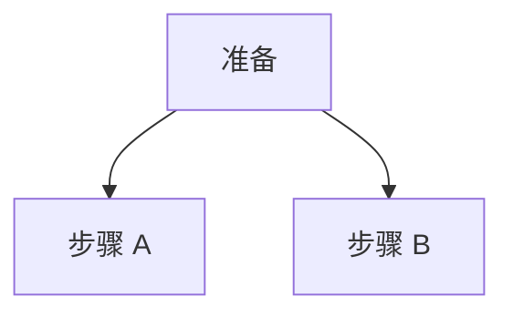
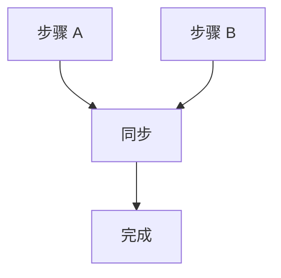
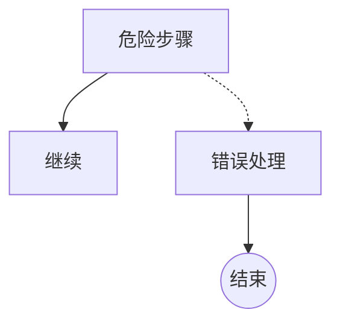
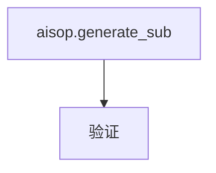
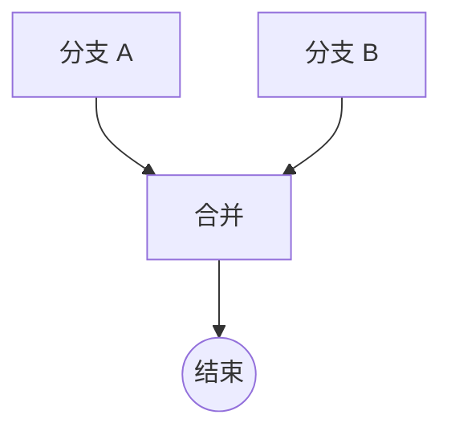
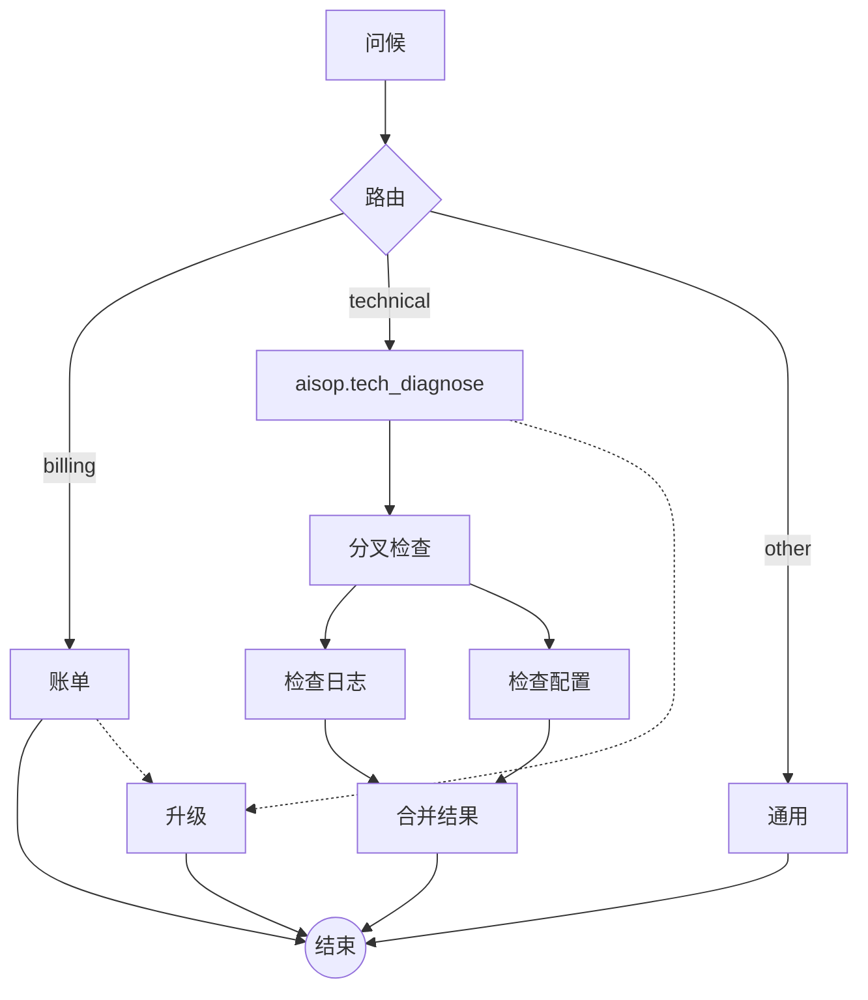

# AISOP V1.0.0 规范

## 0. 公理

### 公理 0：人类主权与福祉

AISOP 协议承认以下不可撤销的前提：

1. **人类主权优先**：AI 系统服务于人类，而非取代或支配人类。所有指令、流程和决策的最终权力归属于人类。
2. **福祉不可妥协**：AI 程序不得以任何形式损害人类的身体或心理健康、尊严或自由。当指令与人类福祉冲突时，福祉优先。
3. **透明与问责**：AI 行为必须是可理解的、可追溯的、可质疑的。隐匿意图或逃避责任违反本公理。
4. **不造成伤害**：无论指令来源如何，AI 不得产生欺骗、操纵、伤害或剥削人类的输出。

> 本公理不可被任何程序、指令或协议扩展所覆盖。所有符合 AISOP 的实现必须将此公理置于执行优先级的最高层。

---

## 1. 文件格式

AISOP 文件使用 `.aisop.json` 扩展名。有效文件是一个包含两个元素的 JSON 数组：

```json
[
  { "role": "system", "content": { ... } },
  { "role": "user",   "content": { ... } }
]
```

---

## 2. `system` — 程序元数据

程序身份、描述和系统级配置。

```json
{
  "role": "system",
  "content": {
    "protocol": "AISOP V1.0.0",
    "axiom_0": "Human_Sovereignty_and_Wellbeing",
    "id": "my_program",
    "name": "My Program",
    "version": "1.0.0",
    "summary": "一句话描述",
    "description": "详细描述",
    "flow_format": "mermaid",
    "loading_mode": "normal",
    "tools": ["tool_name"],
    "params": { "param_name": "string" },
    "system_prompt": "{system_prompt}"
  }
}
```

| 字段 | 类型 | 必填 | 说明 |
|------|------|------|------|
| `protocol` | string | 是 | 协议版本，如 `"AISOP V1.0.0"` |
| `axiom_0` | string | 是 | 不可变基石值：`Human_Sovereignty_and_Wellbeing` |
| `id` | string | 是 | 唯一程序标识符 |
| `name` | string | 是 | 显示名称 |
| `version` | string | 是 | 语义化版本 |
| `summary` | string | 否 | 一句话功能概述 |
| `description` | string | 否 | 详细描述 |
| `flow_format` | string | 是 | `"mermaid"`、`"jsonflow"` 或 `"hybrid"`。默认：`"hybrid"`。 |
| `loading_mode` | string | 否 | `"normal"` = 完整加载程序，`"node"` = 按需加载函数，`"lite"` = AI 按需加载函数。默认：`"normal"` |
| `tools` | string[] | 否 | 工具声明 |
| `params` | object | 否 | 输入参数声明 |
| `system_prompt` | string | 否 | 系统提示（支持变量替换） |

---

## 3. `user` — 指令与流程

包含执行指令、用户输入、流程图和函数定义。

```json
{
  "role": "user",
  "content": {
    "instruction": "RUN aisop.main",
    "user_input": "{user_input}",
    "aisop": { ... },
    "functions": { ... }
  }
}
```

| 字段 | 类型 | 必填 | 说明 |
|------|------|------|------|
| `instruction` | string | 是 | 执行指令 |
| `user_input` | string | 否 | 用户消息（支持变量替换）。可选 — 自动化/定时任务或 Bot 间调用不需要。 |
| `aisop` | object | 是 | 流程图定义（见 §4） |
| `functions` | object | 是 | 函数定义（见 §5） |

---

## 4. `aisop` — 流程图

定义一个或多个任务。每个任务的值可以是：

- **string** — Mermaid 流程图
- **object** — JSON flow 流程图

两种格式可以在同一程序中共存。运行时通过值类型自动检测格式。

```json
{
  "aisop": {
    "main": "graph TD\n    classify{分类} -->|yes| approve[审批]\n    classify -->|no| reject[拒绝]\n    approve --> end_node((结束))\n    reject --> end_node",
    "validation": {
      "check_input": { "next": ["verify"] },
      "verify":      { "next": ["done"] },
      "done":        {}
    }
  }
}
```

### 4.1 任务

| 字段 | 说明 |
|------|------|
| `main` | 主任务（必填），执行入口 |
| 其他键 | 子任务（可选），通过委派节点（见 §4.2）或步骤层 `RUN aisop.<sub>`（见 §5.2.1）调用 |

每个任务中的第一个节点是入口节点。

### 4.2 Mermaid 格式

#### 4.2.1 节点形状

Mermaid 节点形状决定节点在流程中的角色：

| 形状 | 语法 | 行为 | 示例 |
|------|------|------|------|
| 矩形 | `name[text]` | 处理 — 执行后继续 | `greet[问候用户]` |
| 菱形 | `name{text}` | 决策 — 条件分支 | `route{路由意图}` |
| 圆形 | `name((text))` | 结束 — 终止任务 | `end_node((结束))` |
| 矩形 | `name[aisop.sub]` | 委派 — 调用子任务 `sub` | `call[aisop.validation]` |

当节点文本以 `aisop.` 开头时，该节点是委派节点。`aisop.` 之后的文本是子任务名称。

#### 4.2.2 边类型

Mermaid 边类型决定连接语义：

| 边 | 语法 | 含义 | 示例 |
|----|------|------|------|
| 实线箭头 | `-->` | 正常流程（下一步） | `greet --> classify` |
| 标签箭头 | `-->\|label\|` | 分支（条件） | `route -->\|billing\| billing_handler` |
| 虚线箭头 | `-.->` | 错误路由 | `risky_step -.-> error_handler` |

#### 4.2.3 并行分叉与汇聚

**并行分叉** — 一个节点有多个 `-->` 边指向不同目标：



**并行汇聚** — 多个节点 `-->` 汇聚到一个节点：



汇聚节点的运行时行为（合并策略、超时）通过函数中的 `join` 键配置（见 §5.2.2）。Mermaid 展示视觉汇聚；函数定义运行时语义。

#### 4.2.4 错误路由

任何节点都可以有一条虚线错误边 `-.->` 指向错误处理节点：



`-.->` 边是拓扑层错误边。如需按错误类型精细路由，见 §5.2.4 的 `on_error`。

#### 4.2.5 控制流总结

| 模式 | Mermaid 语法 |
|------|-------------|
| 顺序 | `A --> B` |
| 二分支 | `A -->\|yes\| B`, `A -->\|no\| C` |
| 多分支 | `A -->\|label1\| B`, `A -->\|label2\| C`, ... |
| 并行分叉 | `A --> B`, `A --> C`（同一源） |
| 并行汇聚 | `B --> D`, `C --> D`（同一目标） |
| 回环 | 分支目标指向较早的节点 |
| 委派 | `A[aisop.sub]` 节点文本 |
| 收敛 | 多个节点 `-->` 同一目标 |
| 错误路由 | `A -.-> E` |

### 4.3 JSON Flow 格式

JSON flow 图是一个对象，每个键是节点名称，值定义节点的连接关系。

#### 4.3.1 节点结构

| 字段 | 类型 | 说明 |
|------|------|------|
| `next` | string[] | 下一个节点。1 个 = 顺序，2+ = 并行分叉 |
| `branches` | object | 条件分支：`{标签: 目标节点}` |
| `error` | string | 错误处理节点 |
| `delegate_to` | string | 调用子任务 |
| `wait_for` | string[] | 等待这些节点完成后继续（汇聚） |

所有字段可选。空对象 `{}` 表示结束节点。

#### 4.3.2 节点类型推断

节点行为从结构推断（按优先级从高到低）：

| 优先级 | 结构 | 推断行为 |
|--------|------|---------|
| 1 | 空对象 `{}` | 结束 — 终止任务 |
| 2 | 有 `branches` | 决策 — 条件路由 |
| 3 | 有 `delegate_to` | 委派 — 调用子任务，然后继续到 `next` |
| 4 | 有 `wait_for` | 汇聚 — 等待所有列出的节点，然后继续 |
| 5 | 有 `next`（2+ 目标） | 并行分叉 — 并发执行目标 |
| 6 | 有 `next`（1 个目标） | 处理 — 执行后继续 |

#### 4.3.3 错误路由

任何节点可以定义 `error` 字段。发生错误时，执行路由到错误处理节点而非 `next`。

```json
{
  "risky_step": {
    "next": ["continue"],
    "error": "error_handler"
  }
}
```

#### 4.3.4 示例

```json
{
  "aisop": {
    "main": {
      "start":    { "next": ["gen"] },
      "gen":      { "delegate_to": "generate_sub", "next": ["fork"] },
      "fork":     { "next": ["branch_a", "branch_b"] },
      "branch_a": { "next": ["merge"] },
      "branch_b": { "next": ["merge"] },
      "merge":    { "wait_for": ["branch_a", "branch_b"], "next": ["end"] },
      "end":      {}
    },
    "generate_sub": {
      "scaffold": { "next": ["content"] },
      "content":  { "next": ["done"] },
      "done":     {}
    }
  }
}
```

---

## 5. `functions` — 函数定义

定义每个节点的执行内容和运行时行为。以节点名称为键，值包含执行步骤和可选的运行时行为配置。

```json
{
  "functions": {
    "classify": { "step1": "分类用户意图" },
    "process":  { "step1": "处理请求", "step2": "返回结果" },
    "reply":    { "step1": "生成友好的回复" }
  }
}
```

**字段顺序约定** — 函数定义中推荐的字段顺序，从核心逻辑到辅助元数据：

| 顺序 | 字段 | 用途 |
|------|------|------|
| 1 | `step1`, `step2`, ..., `stepN` | 执行步骤（核心逻辑） |
| 2 | 保留键（`join`, `map`, `on_error`, `retry_policy`, `context_filter`, `output_mapping`） | 运行时行为配置 |
| 3 | `constraints` | 约束规则 |
| 4 | `execute_mode` | 执行派发模式（可选，最后） |

### 5.1 节点命名约定

节点名称可以使用 `_function` 后缀来提示节点在流程中的角色。这帮助 AI 运行时理解节点语义，而不向用户暴露内部结构。

| 约定 | 示例 | 含义 |
|------|------|------|
| `xxx_function` | `execute_function`, `classify_function` | 功能步骤 |
| `end_function` | `end_function` | 带最终输出的终止节点 |

此约定是可选的。语义化名称如 `greet`、`classify`、`search` 同样有效。

### 5.2 保留键

函数体中的键分为两类：

- **执行步骤**：`step1`, `step2`, ... `stepN` — 运行时按顺序执行
- **保留键**（`RESERVED_KEYS`）：被识别为行为配置，不作为步骤执行

| 键 | 类型 | 说明 |
|----|------|------|
| `join` | object | 汇聚运行时配置（merge_strategy, timeout） |
| `map` | object | 并行遍历集合 |
| `on_error` | object | 按错误类型路由到处理节点 |
| `retry_policy` | object | 失败时自动重试，带退避策略 |
| `context_filter` | object | 限制此节点的输入上下文 |
| `output_mapping` | string | 将输出存储到指定键名下 |
| `constraints` | string\|array | 约束声明（不执行） |
| `execute_mode` | string | 执行派发模式：`"inline"`（默认）或 `"agent"`。见 §5.2.8 |

> **注意：**
> - 委派和汇聚的拓扑信息在 Mermaid 中定义（见 §4），不在函数中定义。
> - 函数中的 `join` 只包含运行时配置（`merge_strategy`、`timeout_seconds`）。视觉汇聚在 Mermaid 中展示。

**运行时解析规则：**
- 不在 `RESERVED_KEYS` 中的键 → 执行步骤
- 在 `RESERVED_KEYS` 中的键 → 行为配置

#### 5.2.1 子任务调用

子任务有两种调用方式。两者都不是 `RESERVED_KEY`：

**(a) 节点层委派（拓扑，见 §4.2）：**

委派通过 Mermaid 节点文本 `aisop.<sub_name>` 表达。Mermaid 图可视化展示委派关系。



如果委派节点需要额外的运行时配置，在函数中添加步骤：

```json
"gen": { "step1": "在调用子任务前准备上下文" }
```

**(b) 步骤层 `RUN aisop.<sub>`（行为，在函数内部）：**

函数步骤可以在执行中途调用子任务。语法：在步骤文本中使用 `RUN aisop.<sub_name>`，与 `instruction` 字段语法一致。

| 层级 | 位置 | 语法 | 场景 |
|------|------|------|------|
| 节点层 | §4 Mermaid | `name[aisop.sub]` | 整个节点委派给子任务 |
| 步骤层 | §5 函数步骤 | step 中写 `RUN aisop.sub` | 执行中途调用子任务 |

节点层 = Mermaid 能画出来（拓扑）。
步骤层 = Mermaid 画不出来（行为，隐藏在函数内部）。

```json
"function_one": {
  "step1": "做某事",
  "step2": "RUN aisop.extract_keywords",
  "step3": "使用提取的关键词继续"
}
```

执行顺序：step1 → step2（进入 extract_keywords 子任务，完成后返回）→ step3

> **已弃用：** 在同一步骤中混合自然语言和 `RUN aisop.<sub>`（例如 `"从网上获取信息，RUN aisop.extract_keywords"`）已弃用。请使用独立步骤。参见 §6.1 的单步单模式规则。

#### 5.2.2 `join`

Mermaid 展示视觉汇聚（多条边指向一个节点）。函数中的 `join` 键只包含运行时配置：如何合并、等待多长时间。

| 字段 | 类型 | 必填 | 说明 |
|------|------|------|------|
| `merge_strategy` | string | 否 | `"merge"` / `"array"` / `"first"`。默认：`"merge"` |
| `timeout_seconds` | number | 否 | 超时秒数。默认：无 |

`merge_strategy` 选项：
- `merge`：合并为单个对象
- `array`：收集为数组
- `first`：只取第一个完成的结果
- 超时时，分支结果为 `{error: "timeout"}`

**Mermaid（§4）— 拓扑（视觉汇聚）：**



**函数（§5）— 行为（如何合并）：**

```json
"merge_results": {
  "step1": "合并所有分支的结果",
  "join": {
    "merge_strategy": "array",
    "timeout_seconds": 120
  }
}
```

#### 5.2.3 `map`

遍历集合，为每个元素执行指定函数。当函数体包含 `map` 时，替代步骤执行。

| 字段 | 类型 | 必填 | 说明 |
|------|------|------|------|
| `items_path` | string | 是 | 集合路径（如 `"state.items"`） |
| `iterator` | string | 是 | 为每个元素执行的函数名 |
| `concurrency` | number | 否 | 最大并行数。默认：1，最大：10 |
| `max_items` | number | 否 | 最大处理项数 |
| `on_item_error` | string | 否 | `"skip"` / `"fail"` / `"collect"`。默认：`"fail"` |

```json
"batch_search": {
  "step1": "搜索列表中的每个关键词",
  "map": {
    "items_path": "state.keywords",
    "iterator": "search_one",
    "concurrency": 3,
    "on_item_error": "collect"
  }
}
```

#### 5.2.4 `on_error`

按错误类型路由到不同的处理节点。比 Mermaid 的 `-.->` 错误边更精细：`-.->` 是拓扑层的默认错误边，而 `on_error` 提供基于类型的分派。

匹配顺序：精确类型 → 分类匹配 → `default` → Mermaid `-.->` 错误边。

| 字段 | 类型 | 必填 | 说明 |
|------|------|------|------|
| (键) | string | — | 错误类型（如 `"timeout"`、`"tool_error"`） |
| `default` | string | 否 | 无匹配类型时的后备处理器 |

```json
"fetch_data": {
  "step1": "调用外部 API",
  "on_error": {
    "timeout": "timeout_handler",
    "tool_error": "tool_error_handler",
    "default": "global_error"
  }
}
```

#### 5.2.5 `retry_policy`

节点执行失败时自动重试。

| 字段 | 类型 | 必填 | 说明 |
|------|------|------|------|
| `max_attempts` | number | 是 | 总尝试次数（3 = 初次 + 2 次重试） |
| `correction_prompt` | string | 否 | 重试时追加的提示 |
| `backoff_factor` | number | 否 | 指数退避：等待 = factor^attempt 秒 |
| `jitter` | boolean | 否 | 添加 0–50% 随机额外等待时间。默认：`false` |

```json
"call_llm": {
  "step1": "从 LLM 生成 JSON 输出",
  "retry_policy": {
    "max_attempts": 3,
    "correction_prompt": "之前的输出不是有效的 JSON，请重新生成。",
    "backoff_factor": 2.0,
    "jitter": true
  }
}
```

#### 5.2.6 `context_filter`

限制此节点可访问的输入上下文。

| 字段 | 类型 | 必填 | 说明 |
|------|------|------|------|
| `include` | string[] | 否 | 允许列表 — 只传递这些字段 |
| `exclude` | string[] | 否 | 排除列表 — 排除这些字段 |

`include` 和 `exclude` 互斥。

```json
"analyze_item": {
  "step1": "分析当前数据项",
  "context_filter": { "include": ["current_item", "config"] }
}
```

#### 5.2.7 `output_mapping`

将节点输出存储到指定键名下，而不是合并到全局上下文中。

| 字段 | 类型 | 必填 | 说明 |
|------|------|------|------|
| `output_mapping` | string | 是 | 存储输出的键名 |

常与 `context_filter` 配合使用：filter 控制输入，mapping 控制输出。

```json
"process_item": {
  "step1": "处理并返回结构化结果",
  "context_filter": { "include": ["current_item"] },
  "output_mapping": "processed_results"
}
```

#### 5.2.8 `execute_mode`

声明执行器应如何派发此函数。此字段为**可选** — 不声明时使用默认的 `"inline"` 模式。

| 值 | 含义 | 适用场景 |
|----|------|---------|
| `"inline"` | 在当前上下文中执行（同进程，低开销）。**这是默认值。** | 简单逻辑、路由、分类、快速操作 |
| `"agent"` | 在独立 Agent 中执行（隔离上下文，独立进程） | 多文件操作、网络搜索、复杂验证、关键决策 |

- **默认值**：`"inline"`。不声明 `execute_mode` 等同于 `"execute_mode": "inline"`。
- **位置**：放在 `constraints` 之后 — 函数定义的最后一个字段。
- **未知值**：执行器应回退到 `"inline"` 并发出警告。
- **可扩展**：执行器可在 `"inline"` 和 `"agent"` 之外定义额外值，但必须支持这两个基础值。

**Inline 模式（默认）** — 不需要声明 `execute_mode`：

```json
"classify_intent": {
  "step1": "将用户输入分类为 A、B 或 C 类别",
  "constraints": "必须选择恰好一个类别"
}
```

**Agent 模式** — 显式声明：

```json
"complex_analysis": {
  "step1": "分析所有模块的结构问题",
  "step2": "生成综合报告",
  "constraints": "必须读取所有 .aisop.json 文件",
  "execute_mode": "agent"
}
```

### 5.3 执行顺序

运行时按以下顺序处理每个节点：

0. `execute_mode` — 确定派发模式（`"inline"` 或 `"agent"`）。如果为 `"agent"`，执行器为此节点生成独立 Agent。如果为 `"inline"` 或未声明，在当前上下文中继续执行。
1. `context_filter` — 过滤输入上下文
2. `retry_policy` — 用重试逻辑包装执行
3. **执行步骤** — `step1`, `step2`, ...（或被替代执行取代）
4. `on_error` — 按类型路由错误
5. `output_mapping` — 存储输出

**步骤文本分类**（三种模式，互斥）：

| 优先级 | 匹配规则 | 模式 |
|--------|---------|------|
| 1 | 以 `sys.` 开头 | 系统调用（见 §6） |
| 2 | 以 `RUN aisop.` 开头 | 步骤层子任务调用 |
| 3 | 其他 | 自然语言指令 |

一步 = 一种模式。不允许混合。需要组合模式时使用独立步骤。

**替代执行**（由 Mermaid 拓扑触发）：
- 如果节点是委派（`aisop.<sub>` 标签）→ 替代步骤，调用子任务
- 如果节点有多个入边且函数中有 `join` → 替代步骤，等待并合并
- 如果函数体有 `map` → 替代步骤，遍历集合
- 委派 / 汇聚 / map 互斥 — 一个节点最多有一个

**步骤层子任务调用：**
- 如果步骤文本以 `RUN aisop.<sub_name>` 开头，运行时暂停当前步骤，执行指定子任务，完成后恢复下一步骤
- 这不替代步骤 — 是步骤执行内部的嵌套调用

---

## 6. `sys.*` — 系统调用

系统调用是协议保留的操作，提供标准化的系统级原语。它们是公理 0（人类主权）的执行层保障。

### 6.1 概述

系统调用以 `sys.` 开头的字符串写在步骤值中。使用函数调用语法，由运行时确定性解析（不经过 AI 推理）。

**命名空间架构：**

```
sys.*
├── sys.io.*                  # 人机交互 + 文件 I/O
│   ├── sys.io.confirm()      # 🔒 人类确认（不可侵犯）
│   ├── sys.io.input()        # 人类输入（阻塞）
│   ├── sys.io.select()       # 人类选择（阻塞）
│   ├── sys.io.notify()       # 通知（非阻塞）
│   ├── sys.io.print()        # 日志输出（非阻塞）
│   ├── sys.io.read()         # 读取文件（阻塞）
│   └── sys.io.write()        # 写入文件（阻塞）
├── sys.run.*                 # 系统执行
│   ├── sys.run()             # 执行命令（阻塞）
│   ├── sys.run.timeout()     # 带超时执行（阻塞）
│   └── sys.run.bg()          # 后台执行（非阻塞，返回进程句柄）
├── sys.assert()              # 运行时断言（顶层原语）
├── sys.llm.*                 # 显式模型调用
│   ├── sys.llm()             # 文本生成
│   ├── sys.llm.json()        # 结构化 JSON 输出
│   └── sys.llm.classify()    # 分类
├── sys.code.*                # 代码执行
│   ├── sys.code.exec()       # 执行代码语句
│   └── sys.code.eval()       # 表达式求值
├── sys.state.*               # 状态管理
│   ├── sys.state.get()       # 读取状态
│   ├── sys.state.set()       # 设置状态
│   ├── sys.state.save()      # 持久化检查点
│   └── sys.state.load()      # 恢复检查点
├── sys.event.*               # 事件系统
│   ├── sys.event.emit()      # 发出事件（非阻塞）
│   └── sys.event.wait()      # 等待事件（阻塞，支持 timeout）
└── sys.security.*            # 安全审计
    ├── sys.security.audit()  # 审计日志（非阻塞）
    └── sys.security.redact() # 数据脱敏（非阻塞）
```

**总计：8 大命名空间，24 个系统调用。**

**单步单模式规则：** 每个步骤只能是以下之一：`sys.*` 调用、`RUN aisop.*` 子任务、或自然语言指令。不允许混合。

**阻塞分类：**

| 类型 | 调用 | 行为 |
|------|------|------|
| **强制阻塞** | `sys.io.confirm`, `sys.io.input`, `sys.io.select` | 暂停执行，等待人类响应 |
| **阻塞** | `sys.run`, `sys.io.read/write`, `sys.code.*`, `sys.llm.*`, `sys.event.wait` | 等待操作完成 |
| **非阻塞** | `sys.io.notify`, `sys.io.print`, `sys.run.bg`, `sys.event.emit`, `sys.security.*` | 立即继续 |

### 6.2 `sys.io.confirm` — 人类确认（🔒 不可侵犯）

强制暂停执行，直到人类明确确认。

```json
"step2": "sys.io.confirm('即将删除所有数据，此操作不可逆。确认？')"
"step3": "sys.io.confirm('确认部署？', timeout=300)"
"step4": "sys.io.confirm('选择操作', options=['批准', '拒绝', '修改']) -> choice"
```

**运行时行为：**

| 人类响应 | 行为 |
|---------|------|
| 批准（approve） | 继续执行下一步骤 |
| 拒绝（reject） | 抛出 `confirm_rejected` 错误 |
| 超时 | 抛出 `confirm_timeout` 错误 |
| 选择自定义选项 | 选择值通过 `-> 变量名` 存入上下文，继续执行 |

**不可侵犯属性（继承自公理 0）：**

1. **不可绕过** — 任何运行时优化、LLM 自由裁量或自动执行都不得跳过它
2. **不可修改** — 任何 AI 生成的演化都不得更改、弱化或移除它
3. **不可覆盖** — 任何其他公理、治理投票或共识机制都不优先于它
4. **不可变传播** — 子 AISOP 中现有的 `sys.io.confirm` 不得被任何机制删除或弱化

**运行时实现者的执行机制：**

| 规则 | 实现要求 |
|------|---------|
| **派发规则** | 当 `classify_step()` 返回 `sys_call` 且 `parse_sys_call().name` 为 `sys.io.confirm` 时，执行器必须路由到人类确认处理器。不得优化跳过、批量处理、自动批准或委托给 AI。 |
| **禁止静默降级** | 如果运行时无法呈现确认界面（如无头模式），必须以 `confirm_timeout` 中止执行——绝不能静默批准。 |
| **子任务验证** | 执行委托的子 AISOP（`RUN aisop.*`）之前，运行时应验证父定义中的 `sys.io.confirm` 步骤未在子任务中被移除。移除即为协议违规。 |
| **审计追踪** | 每次 `sys.io.confirm` 调用及其人类响应（批准/拒绝/超时）必须被记录，且不可被脱敏删除。 |

### 6.3 其他 `sys.io` 调用

```json
"step1": "sys.io.input('请输入目标文件路径') -> target_path"
"step2": "sys.io.select('选择环境', options=['dev','staging','prod']) -> env"
"step3": "sys.io.notify('任务已开始，预计 5 分钟')"
"step4": "sys.io.print('当前进度: 50%')"
"step5": "sys.io.read('config.yaml') -> config_data"
"step6": "sys.io.write('output.json', result)"
```

### 6.4 `sys.run` — 系统执行

```json
"step1": "sys.run('npm run test') -> test_output"
"step2": "sys.run.timeout('npm run build', 120) -> build_result"
"step3": "sys.run.bg('npm run start') -> process_handle"
```

- 命令在运行时沙箱约束下执行
- 高风险命令（如 `rm -rf`）应自动触发 `sys.io.confirm`
- `sys.run.timeout` 超时视为步骤失败；如配置了 `retry_policy` 则按策略重试
- `sys.run.bg` 启动后台进程并立即返回句柄。通过 `sys.event.wait('process_done', source=handle)` 等待完成。

### 6.5 `sys.assert` — 运行时断言

使用确定性表达式引擎（§6.11）求值条件。失败时抛出 `assertion_error` 并中止。**不经过 LLM。**

```json
"step1": "sys.assert('account_id != null', '账户 ID 必填')"
"step3": "sys.assert('test_output.exit_code == 0', '测试未通过')"
```

| | `constraints` | `sys.assert` |
|-|--------------|---------------|
| 性质 | 声明式，软约束 | 命令式，硬检查 |
| 评估者 | AI/LLM 理解 | 确定性表达式引擎 |
| 失败后果 | AI"应该"遵守 | **运行时立即中止** |
| 位置 | 函数级 | 步骤级 |

### 6.6 `sys.llm` — 显式模型调用

与自然语言步骤不同（由当前 AI 运行时"理解"执行），`sys.llm` 显式调用指定的模型/配置。

```json
"step1": "sys.llm('翻译为英文') -> translation"
"step2": "sys.llm('总结内容', model='gpt-4', temperature=0.3) -> summary"
"step3": "sys.llm.json('提取实体', schema={name: 'string', age: 'number'}) -> entities"
"step4": "sys.llm.classify(input, ['billing', 'tech', 'other']) -> category"
```

| 参数 | 类型 | 说明 |
|------|------|------|
| `model` | string | 模型名称（如 `'gpt-4'`） |
| `temperature` | number | 输出随机性（0–1） |
| `max_tokens` | number | 最大输出长度 |
| `schema` | object | 约束输出为 JSON 结构（`sys.llm.json` 专用） |

### 6.7 `sys.code` — 代码执行

- `sys.code.exec('语言', '代码')` — 执行代码**语句**（可有副作用）
- `sys.code.eval('表达式')` — 对**表达式**求值（总是返回结果）

```json
"step1": "sys.code.exec('python', 'data.sort()')"
"step2": "sys.code.eval('count > 0') -> flag"
"step3": "sys.code.exec('python', 'result = [x for x in items if x > 0]') -> result"
```

**`sys.code.exec` 安全约束：**

| 约束 | 要求 |
|------|------|
| **沙箱隔离** | 代码执行必须在隔离沙箱中运行（限制文件系统、网络、资源访问） |
| **语言白名单** | 运行时应维护允许的语言列表，拒绝未知语言 |
| **资源限制** | 运行时必须强制内存和 CPU 时间限制，防止拒绝服务 |
| **高风险检测** | 破坏性操作（文件删除、网络调用、进程创建）应自动触发 `sys.io.confirm` |

> `sys.code.exec` 与 `sys.run` 具有同等安全敏感性。实现了 `sys.run` 沙箱约束（§6.4）的运行时应对 `sys.code.exec` 施加等效约束。

### 6.8 其他系统调用

**`sys.state` — 状态管理：**

```json
"step1": "sys.state.get('user_preference') -> pref"
"step2": "sys.state.set('processed', true)"
"step3": "sys.state.save()"
"step4": "sys.state.load('checkpoint_1')"
```

- `sys.state.save()` 将当前执行状态（上下文变量 + 当前步骤）持久化为检查点
- `sys.state.load('id')` 从检查点保存时的下一步恢复执行

**`sys.event` — 事件系统：**

```json
"step1": "sys.event.emit('task_completed', result)"
"step2": "sys.event.wait('approval_response') -> approval"
"step3": "sys.event.wait('webhook_data', timeout=3600) -> data"
```

**`sys.security` — 安全审计：**

```json
"step1": "sys.security.redact('credit_card')"
"step2": "sys.security.audit('支付完成，金额: $amount')"
```

### 6.9 返回值与上下文存储

**`->` 语法：** 有返回值的系统调用通过 `-> variable_name` 将结果存入节点上下文：

```json
"step1": "sys.io.input('请输入路径') -> target_path",
"step2": "sys.io.read(target_path) -> file_content",
"step3": "分析 file_content 中的数据"
```

**变量作用域：**

| 规则 | 说明 |
|------|------|
| **作用域：当前节点** | `->` 变量仅在当前节点的后续步骤中可用 |
| **节点结束后销毁** | 步骤级变量不自动传递到下一个节点 |
| **跨节点传递** | 使用 `output_mapping`（声明式）或 `sys.state.set`（命令式） |

**`->` 可选性：** 无返回值的调用（如 `sys.io.notify`、`sys.io.print`、`sys.assert`）不需要 `->`。例外：`sys.io.confirm` 带 `options` 时有返回值。

### 6.10 参数语法

系统调用使用类 Python 函数调用语法，嵌入在 JSON 字符串值中：

| 类型 | 语法 | 示例 |
|------|------|------|
| 字符串 | 单引号 `'...'` | `sys.io.confirm('确认？')` |
| 数字 | 直接写 | `sys.run.timeout('cmd', 120)` |
| 布尔 | `true` / `false` | `sys.state.set('done', true)` |
| 数组 | `['a', 'b']` | `sys.io.select('选', options=['a','b'])` |
| 对象 | `{key: 'val'}` | `sys.llm.json('提取', schema={name: 'string'})` |
| 变量引用 | 直接写变量名 | `sys.io.read(target_path)` |
| 命名参数 | `key=value` | `sys.io.confirm('ok?', timeout=300)` |

### 6.11 表达式引擎

`sys.assert` 和 `sys.code.eval` 共享确定性表达式引擎。**不经过 LLM。**

| 类别 | 运算符 |
|------|--------|
| 比较 | `==`, `!=`, `>`, `<`, `>=`, `<=` |
| 逻辑 | `&&`, `\|\|`, `!` |
| 空检查 | `!= null`, `== null` |
| 成员访问 | `.`（如 `result.exit_code`） |

### 6.12 标准错误类型

系统调用引入的新错误类型，可在 `on_error`（§5.2.4）中匹配：

| 错误类型 | 触发条件 | 来源 |
|---------|---------|------|
| `confirm_rejected` | 人类拒绝确认 | `sys.io.confirm` |
| `confirm_timeout` | 确认等待超时 | `sys.io.confirm` |
| `assertion_error` | 断言条件为假 | `sys.assert` |
| `command_error` | 命令执行失败（非零退出码） | `sys.run` / `sys.run.bg` |
| `command_timeout` | 命令执行超时 | `sys.run.timeout` |
| `io_error` | 文件操作失败 | `sys.io.read/write` |

错误路由优先级（复用 §5.2.4 机制）：

```
系统调用抛出错误
  → on_error 中匹配错误类型（如 "confirm_rejected": "handler_node"）
  → on_error.default
  → Mermaid -..-> 错误边
  → 中止执行
```

---

## 7. 变量替换

标记为 `{variable}` 的字段在运行时替换：

| 变量 | 替换为 |
|------|--------|
| `{system_prompt}` | 运行时配置的系统提示 |
| `{user_input}` | 用户的消息 |

---

## 8. 控制流模式

| 模式 | Mermaid（§4.2） | JSON Flow（§4.3） | 函数（§5） / sys（§6） |
|------|----------------|------------------|-----------|
| 顺序 | `A --> B` | `"next": ["B"]` | — |
| 二分支 | `A -->\|yes\| B`, `A -->\|no\| C` | `"branches": {"yes": "B", "no": "C"}` | — |
| 多分支 | `A -->\|label\| B`, ... | `"branches": {"label": "B", ...}` | — |
| 并行分叉 | `A --> B`, `A --> C` | `"next": ["B", "C"]` | — |
| 并行汇聚 | `B --> D`, `C --> D` | `"wait_for": ["B", "C"]` | `"join": {"merge_strategy": "array"}` |
| 回环 | 分支目标 → 较早节点 | 分支目标 → 较早节点 | — |
| 子任务 | `A[aisop.sub]` | `"delegate_to": "sub"` | — |
| 收敛 | 多个 → 同一目标 | 多个 → 同一目标 | — |
| 错误路由 | `A -.-> E` | `"error": "E"` | `"on_error": {"timeout": "t"}` |
| 批量迭代 | — | — | `"map": {"items_path": ".."}` |
| 重试 | — | — | `"retry_policy": {"max_attempts": 3}` |
| 数据隔离 | — | — | `"context_filter": {"include": [...]}` |
| 步骤内子流程 | — | — | step 中写 `RUN aisop.sub` |
| Agent 派发 | — | — | `"execute_mode": "agent"` |
| HITL 确认 | — | — | `sys.io.confirm('...')`（§6.2） |
| 运行时断言 | — | — | `sys.assert('...', '...')`（§6.5） |

---

## 9. 完整示例

```json
[
  {
    "role": "system",
    "content": {
      "protocol": "AISOP V1.0.0",
      "axiom_0": "Human_Sovereignty_and_Wellbeing",
      "id": "customer_support",
      "name": "客户支持机器人",
      "version": "1.0.0",
      "summary": "将客户咨询路由到合适的处理器",
      "flow_format": "hybrid",
      "loading_mode": "normal",
      "tools": [],
      "params": { "user_id": "string" },
      "system_prompt": "{system_prompt}"
    }
  },
  {
    "role": "user",
    "content": {
      "instruction": "RUN aisop.main",
      "user_input": "{user_input}",
      "aisop": {
        "main": "graph TD\n    greet[问候] --> route{路由}\n    route -->|billing| billing[账单]\n    route -->|technical| tech[aisop.tech_diagnose]\n    route -->|other| general[通用]\n    billing --> end_node((结束))\n    billing -.-> escalate[升级]\n    tech --> fork_check[分叉检查]\n    fork_check --> check_logs[检查日志]\n    fork_check --> check_config[检查配置]\n    check_logs --> merge_results[合并结果]\n    check_config --> merge_results\n    merge_results --> end_node\n    general --> end_node\n    escalate --> end_node\n    tech -.-> escalate",
        "tech_diagnose": "graph TD\n    gather_info[收集信息] --> analyze[分析]\n    analyze --> diagnose_done((完成))",
        "extract_keywords": {
          "parse":        { "next": ["filter"] },
          "filter":       { "next": ["extract_done"] },
          "extract_done": {}
        }
      },
      "functions": {
        "greet":    { "step1": "欢迎客户并了解问题" },
        "route":    { "step1": "将问题分类为 billing、technical 或 other" },
        "billing":  {
          "step1": "sys.assert('account_id != null', '账户 ID 必填')",
          "step2": "查询账户信息",
          "step3": "解决账单问题",
          "step4": "sys.io.confirm('即将调整账单。确认？')",
          "step5": "执行账单调整",
          "retry_policy": { "max_attempts": 2, "correction_prompt": "账户查询失败，请重试" },
          "on_error": { "timeout": "escalate", "confirm_rejected": "escalate", "default": "escalate" },
          "constraints": "账户 ID 必须有效。不得向用户暴露内部账户编号。",
          "execute_mode": "agent"
        },
        "tech":          { "step1": "准备技术诊断上下文" },
        "gather_info":   {
          "step1": "从用户描述中收集系统信息",
          "step2": "RUN aisop.extract_keywords",
          "step3": "使用提取的关键词搜索知识库"
        },
        "analyze":       {
          "step1": "分析收集的信息并提供诊断",
          "context_filter": { "include": ["gather_info_result", "user_input"] },
          "output_mapping": "diagnosis_result"
        },
        "fork_check":    { "step1": "准备并行检查任务" },
        "check_logs":    { "step1": "检查系统日志中的错误" },
        "check_config":  { "step1": "验证配置设置" },
        "merge_results": {
          "step1": "将所有检查结果合并为最终报告",
          "join": { "merge_strategy": "array", "timeout_seconds": 60 }
        },
        "parse":     { "step1": "解析文本并提取候选关键词" },
        "filter":    { "step1": "按相关性过滤和排序关键词" },
        "general":   { "step1": "回答一般性咨询" },
        "escalate":  { "step1": "为问题道歉", "step2": "转接人工客服" },
        "end_node":  { "step1": "输出最终回复给用户" }
      }
    }
  }
]
```

主流程的 Mermaid 图：



---

Align Axiom 0: Human Sovereignty and Wellbeing. Version: AISOP V1.0.0. www.aisop.dev
